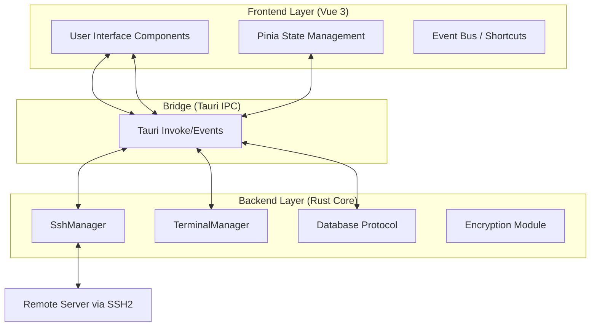
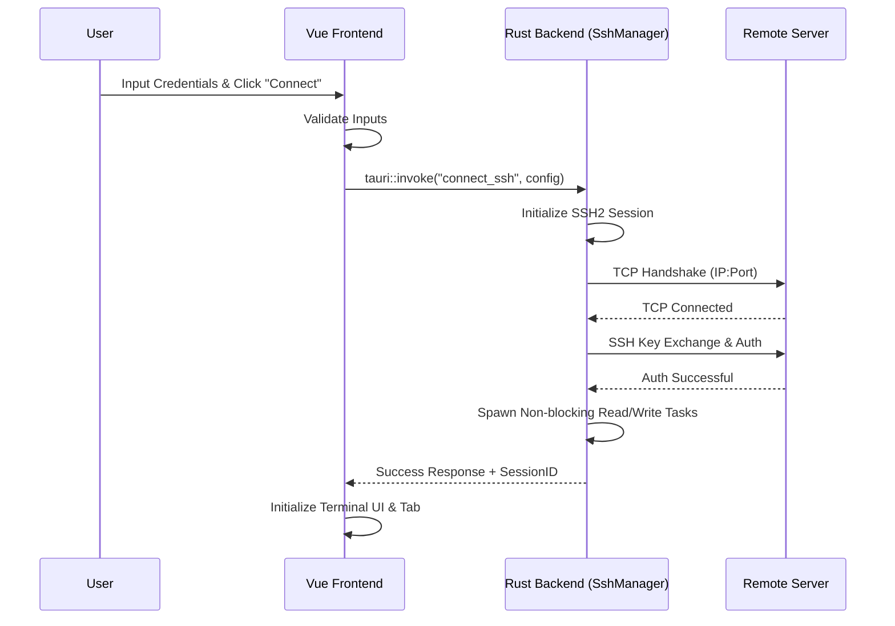
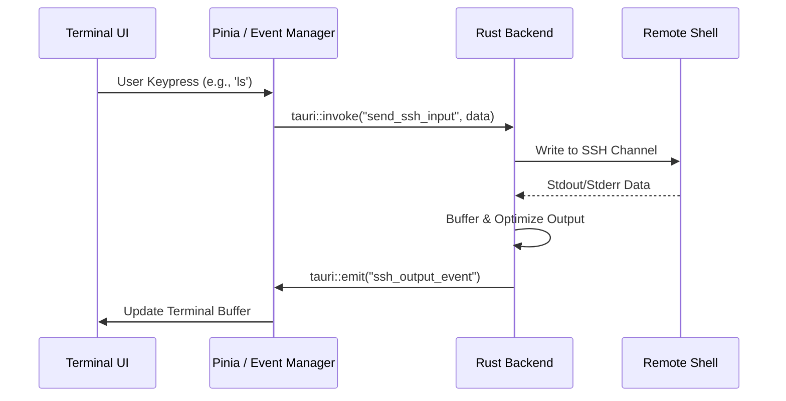

# NexaShell

Lightweight, modern terminal manager and SSH client built with **Rust** and **Vue 3**, packaged as a Tauri desktop application.

[](https://github.com/chengvar/nexashell)
[](LICENSE)

NexaShell combines the safety and performance of Rust with a modern, high-productivity web-based UI to provide a seamless server management experience.

---

## 🚀 Key Features

- **Multi-Session Management**: Organize and switch between multiple SSH sessions using a robust tab-based interface.
- **Session Persistence & Grouping**: Securely store server credentials with support for hierarchical grouping and custom tagging.
- **Hardware-Accelerated Terminal**: Integrated terminal with low-latency rendering, supporting complex CLI tools and character encoding.
- **Integrated SFTP Support**: Built-in file explorer and transfer capabilities for easy remote file manipulation.
- **Real-time Server Dashboard**: Monitor remote server status (CPU, Memory, Disk) directly from the connection view.
- **Customizable Workspace**: Support for Dark/Light modes and flexible UI layouts.
- **Cross-Platform**: Consistent experience across macOS (Apple Silicon/Intel), Windows, and Linux.

---

## 🏗️ Architecture Design

NexaShell adopts a **Multi-Process Architecture** powered by [Tauri](https://tauri.app/), separating the UI concerns from the low-level system operations.

### High-Level Overview



### 🧩 Layer Responsibilities

- **Frontend (View Layer)**: Built with Vue 3 and TypeScript. Pinia handles session lifecycle, user settings, and UI states. Uses `xterm.js` with WebGL acceleration for GPU-accelerated rendering.
- **Backend (Service Layer)**: Built on `ssh2-rs` and `tokio`. Handles high-performance, non-blocking SSH communication and local data persistence with AES encryption.

---

## 🔗 Key Workflows

### SSH Connection Sequence



### Terminal I/O Stream



---

## 🛠️ Installation & Development

### Prerequisites

- **Node.js**: (recommended via nvm) and **pnpm**
- **Rust toolchain**: (stable) and **cargo**
- **Tauri CLI dependencies**: Platform-specific (see [Tauri documentation](https://tauri.app/v1/guides/getting-started/prerequisites))

### Quick Setup

```bash
# Install frontend dependencies
pnpm install

# Run native development (opens the Tauri window)
pnpm tauri dev
```

### Development Commands

- **Run Vite dev server** (Web only): `pnpm dev`
- **Run full native app**: `pnpm tauri dev`
- **Build production bundle**:
  ```bash
  pnpm build
  pnpm tauri build
  ```
- **Run Tests**:
  ```bash
  pnpm test         # Unit tests (Vitest)
  pnpm test:ui      # Vitest UI
  ```

---

## ⚙️ Technical Details

### Key IPC / Tauri Commands

The backend exposes these Tauri commands and events (implemented in `src-tauri/src/ssh.rs`, `src-tauri/src/db.rs`):

- **SSH Commands**: `connect_ssh`, `disconnect_ssh`, `send_ssh_input`, `upload_file_sftp`, `probe_remote_path`.
- **Database Management**: `list_sessions`, `add_session`, `save_session`, `add_group`, `list_groups`.
- **System**: `get_platform`, `read_file_preview`, `toggle_maximize`.

### Project Structure

- `src/` — Frontend renderer (Vue 3 + TypeScript)
  - `src/components/` — UI components (SSH form, Terminal, Dashboards)
  - `src/features/` — Feature modules (session, settings, tabs)
  - `src/core/` — Core utilities (i18n, shortcut manager, themes)
- `src-tauri/` — Rust backend
  - `src-tauri/src/ssh.rs` — SSH manager and channel implementation
  - `src-tauri/src/db.rs` — SQLite database manager
  - `src-tauri/src/lib.rs` — Tauri initialization

---

## 🛡️ Security

- **Credential Safety**: All passwords and private keys are encrypted locally before being stored in the SQLite database.
- **Rust Memory Safety**: The core SSH logic is implemented in memory-safe Rust, preventing common security vulnerabilities.
- **Sandboxed WebView**: The frontend runs in a restricted context with communication via secure IPC.

---

**NexaShell** is licensed under the [MIT License](LICENSE).
