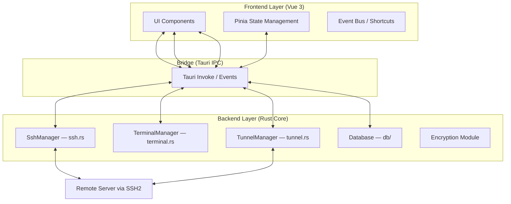
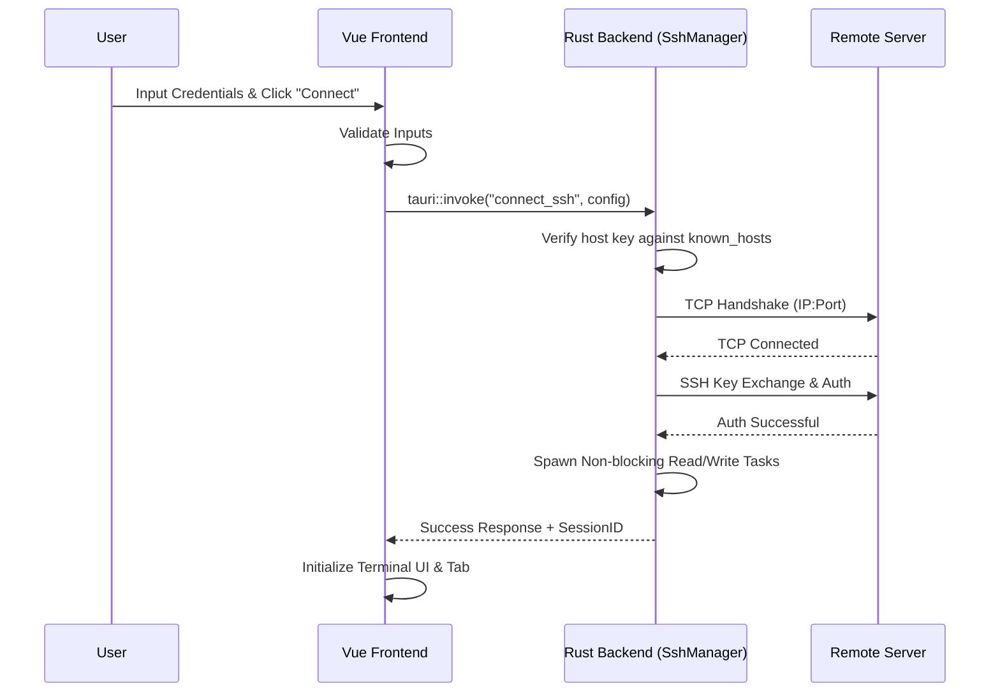
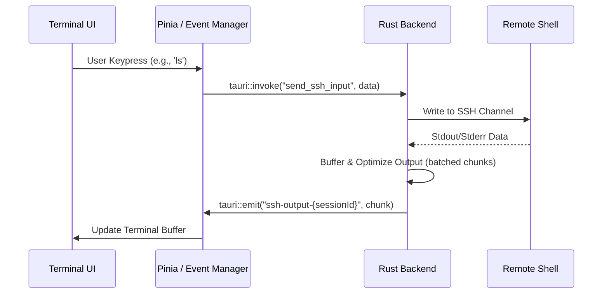

# NexaShell

**English** | [简体中文](README.zh-CN.md)

Lightweight, modern terminal manager and SSH client built with **Rust** and **Vue 3**, packaged as a Tauri 2 desktop application.

[](https://github.com/chengvar-glitch/nexashell) [](LICENSE) [](.github/workflows/ci.yml)

> Version is sourced from `src-tauri/Cargo.toml` (single source of truth, synced to `package.json` by `prebuild`). See [CHANGELOG.md](./CHANGELOG.md) for release history.

NexaShell combines the safety and performance of Rust with a modern, high-productivity web-based UI to provide a seamless server management experience.

---

## 🚀 Key Features

- **Multi-Session Management**: Organize and switch between multiple SSH sessions using a robust tab-based interface.
- **Split Panes**: Split any terminal tab horizontally or vertically (⌘D / ⇧⌘D), drag to resize, right-click to split, up to **3 panes per tab**. SSH panes reuse the source session's credentials without exposing them to reactive state.
- **Session Persistence & Grouping**: Securely store server credentials with support for hierarchical grouping and custom tagging (AES-256-GCM encrypted).
- **Hardware-Accelerated Terminal**: Integrated terminal with low-latency rendering powered by `xterm.js` + WebGL, plus in-terminal search (⌘F).
- **Terminal Theme System**: One Dark / Modern / Solarized / GitHub presets, following the system light/dark mode by default.
- **Integrated SFTP Support**: Built-in file explorer with upload (drag & drop, pause/resume/cancel, resume-at-block-boundary), download, mkdir, rename, and delete.
- **Standalone File Manager Window**: Detached SFTP browsing window per session, opened from the connection view.
- **SSH Port Forwarding**: Local (`-L`) and dynamic SOCKS5 (`-D`) tunnels, auto-started for persisted rules on connect.
- **Command Snippet Library**: Reusable command snippets with a quick-launch command palette (⌘⇧P).
- **Real-time Server Dashboard**: Monitor remote server status (CPU, Memory, Disk, Network, Swap, Load, Uptime) directly from the connection view.
- **Local Terminal**: Native PTY-backed local shell tabs.
- **Security Hardening**: Host key verification against `known_hosts`, OS keychain-backed master key with file fallback, CSP, minimal Tauri capabilities.
- **Session Import/Export**: Encrypted export (random salt, PBKDF2) with backward-compatible decryption of legacy formats.
- **Customizable Workspace**: Dark/Light modes, multiple accent colors, and a native-feeling macOS overlay title bar.
- **Cross-Platform**: macOS (Apple Silicon) is the primary verified platform; Windows builds are continuously compiled in CI (see [Platform Status](#-platform-status)).

---

## 🛠️ Getting Started

### Prerequisites

- [Rust](https://www.rust-lang.org/tools/install) (latest stable)
- [Node.js](https://nodejs.org/) (>=18) — runtime for pnpm and the frontend toolchain
- [pnpm](https://pnpm.sh/) (>=9) — package manager

### Build from Source

```bash
# 1. Clone the repository
git clone git@github.com:chengvar-glitch/nexashell.git
cd nexashell

# 2. Install dependencies
pnpm install

# 3. Run in development mode (opens the Tauri window)
pnpm tauri dev

# 4. Build for production
pnpm build && pnpm tauri build
```

---

## 🖥️ Terminal UI (TUI)

NexaShell ships a lightweight **ratatui**-based TUI frontend (`src-tui/`) that shares the exact same encrypted SQLite database and `known_hosts` as the desktop app — you can manage the same sessions from a plain terminal (e.g. over SSH, or on servers/CI boxes).

```bash
# Run the TUI (requires a Rust toolchain)
pnpm tui
# or directly:
cargo run --manifest-path src-tui/Cargo.toml
```

| Feature | Desktop app | TUI | Notes |
|---|---|---|---|
| Session list / filter / favorites / tags | ✅ | ✅ | shown in the session list |
| New session (password / key auth) | ✅ | ✅ | `ctrl+p` → `new`, or `ctrl+x n` |
| SSH terminal (vt100 emulation) | ✅ | ✅ | bracketed paste, resize sync, live status bar |
| Server status (CPU/mem/latency/load) | ✅ | ✅ | helper-session monitoring |
| Terminal scrollback / copy mode | ✅ | ✅ | `PgUp`/`PgDn`/`Home`/`End` + mouse wheel scroll; `ctrl+x c` copy mode, `enter`/`ctrl+c` copies |
| Multi-session tabs | ✅ | ✅ | `ctrl+tab` / `ctrl+shift+tab` or leader `t` switch; leader `1`-`9` jump; disconnect keeps the rest open |
| Session edit / delete / favorite toggle | ✅ | ✅ | `ctrl+x e` / `ctrl+x d` / `ctrl+x f` on the home list | 
| Command snippets | ✅ | ✅ | shown in the command palette (`ctrl+p`); inserts into the active terminal or copies to clipboard |
| Tunnel rules (start/stop) | ✅ | ✅ | `ctrl+x u` or palette `tunnels`; local `-L` + dynamic SOCKS5 `-D`, per-rule start/stop with connection counter |
| SFTP file browser | ✅ | ✅ | `ctrl+x s` on a connected session; browse/cd, download, upload, mkdir, delete |
| Local (PTY) terminal | ✅ | ⏳ planned | — |
| Import/export, group/tag management | ✅ | ⏳ planned | — |

> The TUI is a separate crate (`nexashell-tui`); CI gates it with `cargo check` + `test` + `clippy -D warnings`. Sensitive credentials stay encrypted on disk and are decrypted only at connect time.

---

## 🏗️ Architecture Design

NexaShell adopts a **Multi-Process Architecture** powered by [Tauri 2](https://tauri.app/), separating the UI concerns from the low-level system operations.

### High-Level Overview


```mermaid
graph TD
    subgraph "Frontend Layer (Vue 3)"
        UI[UI Components]
        Store[Pinia State Management]
        EB[Event Bus / Shortcuts]
    end

    subgraph "Bridge (Tauri IPC)"
        Invoke[Tauri Invoke / Events]
    end

    subgraph "Backend Layer (Rust Core)"
        SSH[SshManager — ssh.rs]
        TERM[TerminalManager — terminal.rs]
        TUN[TunnelManager — tunnel.rs]
        DB[Database — db/]
        SEC[Encryption Module]
    end

    UI <--> Invoke <--> SSH
    UI <--> Invoke <--> TERM
    UI <--> Invoke <--> TUN
    Store <--> Invoke <--> DB
    SSH <--> Remote[Remote Server via SSH2]
    TUN <--> Remote
```

### Backend Modules (`src-tauri/src/`)

| Module | Responsibility |
|---|---|
| `ssh.rs` (~2,600 lines) | SSH connection lifecycle, blocking I/O with `SO_KEEPALIVE`, batched output events, server status monitoring, SFTP upload/download with per-task control (pause/resume/cancel) |
| `ssh/hostkey.rs` | Host key verification against the user's `known_hosts` |
| `db/mod.rs` | SQLite (sessions, groups, tags, tunnel rules, snippets) with WAL, migrations, transactional updates |
| `db/import_export.rs` | Encrypted session import/export (PBKDF2 + AES-GCM), legacy format compat |
| `encryption.rs` | AES-256-GCM + PBKDF2 (390k iterations), OS keychain master key with 0600-file fallback, `zeroize` on sensitive buffers |
| `terminal.rs` | Local PTY via `portable-pty`, batched input writes, resize listeners |
| `tunnel.rs` | Local port forwarding + SOCKS5 dynamic forwarding over existing SSH sessions |
| `system.rs` | Platform detection, window controls, file preview helpers |

### Frontend Structure (`src/`)

- `components/` — UI components (connections, layout, file manager, settings, palette…)
- `features/` — Feature modules with barrel exports: `session`, `tabs`, `tunnel`, `snippet`, `settings`, `window`
- `composables/` — Reusable logic (`use-tab-management`, `use-sftp`, `use-transfer-queue`, `use-modal`, `use-remote-path`)
- `core/` — Config, constants, i18n, types, utils (logger, theme manager, shortcut manager, event bus)
- Two HTML entries: `index.html` (main window) and `filemanager.html` (detached SFTP window)

---

## 🔗 Key Workflows

### SSH Connection Sequence


```mermaid
sequenceDiagram
    participant U as User
    participant F as Vue Frontend
    participant B as Rust Backend (SshManager)
    participant S as Remote Server

    U->>F: Input Credentials & Click "Connect"
    F->>F: Validate Inputs
    F->>B: tauri::invoke("connect_ssh", config)
    B->>B: Verify host key against known_hosts
    B->>S: TCP Handshake (IP:Port)
    S-->>B: TCP Connected
    B->>S: SSH Key Exchange & Auth
    S-->>B: Auth Successful
    B->>B: Spawn Non-blocking Read/Write Tasks
    B-->>F: Success Response + SessionID
    F->>F: Initialize Terminal UI & Tab
```

### Terminal I/O Stream


```mermaid
sequenceDiagram
    participant UI as Terminal UI
    participant PC as Pinia / Event Manager
    participant RB as Rust Backend
    participant RS as Remote Shell

    UI->>PC: User Keypress (e.g., 'ls')
    PC->>RB: tauri::invoke("send_ssh_input", data)
    RB->>RS: Write to SSH Channel
    RS-->>RB: Stdout/Stderr Data
    RB->>RB: Buffer & Optimize Output (batched chunks)
    RB->>PC: tauri::emit("ssh-output-{sessionId}", chunk)
    PC->>UI: Update Terminal Buffer
```

---

## ⚙️ Development Commands

| Command | Purpose |
|---|---|
| `pnpm dev` | Vite dev server (web-only, port 1420) |
| `pnpm tauri dev` | Full native app dev mode |
| `pnpm build` | `vue-tsc --noEmit && vite build` |
| `pnpm lint` | ESLint with auto-fix |
| `pnpm lint:check` | ESLint without auto-fix (CI-friendly) |
| `pnpm type-check` | `vue-tsc --noEmit` |
| `pnpm test` | Frontend unit tests (Vitest, happy-dom) |
| `pnpm test:coverage` | Frontend tests with coverage report |
| `cargo test` | Rust unit tests (run from `src-tauri/`) |
| `cargo clippy` | Rust lints (`-D warnings` in CI) |
| `pnpm tauri build` | Production desktop bundle (DMG on macOS, NSIS on Windows) |
| `pnpm tui` | Run the ratatui TUI frontend (`src-tui/`) |

---

## 🔌 Tauri IPC Surface

Backend commands are registered in `src-tauri/src/lib.rs` (`~70` invoke handlers). Grouped overview:

- **System & Window**: `get_platform`, `get_arch`, `is_macos`/`is_windows`/`is_linux`, `quit_app`, `toggle_maximize`, `minimize_window`, `close_window`
- **SSH Connection**: `connect_ssh`, `disconnect_ssh`, `send_ssh_input`, `get_buffered_ssh_output`, `set_ssh_status_refresh_rate`, `probe_remote_path`, `forget_host_key`
- **SFTP**: `upload_file_sftp`, `pause_upload`, `resume_upload`, `cancel_upload`, `sftp_list_dir`, `sftp_download_file`, `cancel_download`, `sftp_remove`, `sftp_mkdir`, `sftp_rename`
- **Local Terminal**: `connect_local`, `disconnect_local`
- **Sessions**: `save_session`, `save_session_with_credentials`, `update_session_timestamp`, `list_sessions`, `get_session_credentials`, `get_sessions`, `get_sessions_with_relations`, `edit_session`, `delete_session`, `toggle_favorite`
- **Groups / Tags**: `add_group` / `add_tag`, `list_groups` / `list_tags`, `edit_group` / `edit_tag`, `delete_group` / `delete_tag`, `link_session_group` / `link_session_tag`, `unlink_session_group` / `unlink_session_tag`, `list_groups_for_session` / `list_tags_for_session`
- **Import/Export**: `export_sessions`, `import_sessions`
- **Tunnels**: `start_session_tunnels`, `start_tunnel_rule`, `stop_session_tunnels`, `stop_tunnel_rule`, `list_tunnel_status`, plus `add_tunnel_rule`, `list_tunnel_rules`, `update_tunnel_rule`, `delete_tunnel_rule`, `delete_tunnel_rules_for_session`
- **Snippets**: `add_snippet`, `list_snippets`, `update_snippet`, `delete_snippet`

**Streaming events** (Tauri `emit`, namespaced per session):
- `ssh-output-{sessionId}` — terminal output chunks (batched)
- `ssh-status-{sessionId}` — server dashboard metrics (CPU/mem/disk/…)
- `ssh-upload-progress-{sessionId}` / `ssh-download-progress-{sessionId}` — SFTP transfer progress
- `ssh-disconnected-{sessionId}` — session ended (server closed / error)
- `ssh-input-{sessionId}` / `ssh-resize-{sessionId}` — frontend → backend (keystrokes / PTY size)

---

## 🛡️ Security

- **Credential Safety**: Passwords and private keys are encrypted with AES-256-GCM before storage; the master key lives in the OS keychain (macOS Keychain / Windows Credential Manager / Linux Secret Service) with a 0600-permissioned file fallback. A corrupted keychain entry is **refused** rather than silently regenerated, so existing credentials are never orphaned.
- **Host Key Verification**: SSH connections verify the remote host key against `known_hosts` (TOFU, `StrictHostKeyChecking`-style) to prevent MITM attacks.
- **Memory Hygiene**: Sensitive plaintext is kept out of reactive frontend state (non-reactive credential cache) and zeroized on drop in Rust.
- **Sandboxed WebView**: Strict CSP (`default-src 'self'`), minimal Tauri capability permissions, `object-src 'none'`.
- **Rust Memory Safety**: All core SSH/terminal logic is implemented in memory-safe Rust.

---

## 🖥️ Platform Status

| Platform | Status |
|---|---|
| macOS (Apple Silicon) | ✅ Supported — fully tested, DMG release builds verified |
| macOS (Intel) | ❌ Not supported (release builds target `aarch64` only) |
| Windows | 🟡 CI-compiled (`cargo check`/`test`/`clippy` on ubuntu; MSVC/NSIS paths not exercised) |
| Linux | 🟡 CI-compiled with webkit2gtk deps; no runtime verification |

> Continuous Integration (`.github/workflows/ci.yml`): lint + type-check + frontend tests (pnpm) and `cargo check` + `test` + `clippy -D warnings` on every push/PR.

---

## 🔐 macOS Release Signing

GitHub Release 的 DMG 默认使用 **ad-hoc 签名**（`signingIdentity: "-"`），下载后若提示「无法验证开发者」，右键「打开」或在 系统设置 → 隐私与安全性 中「仍要打开」即可；若提示「已损坏」，执行 `xattr -cr "/Applications/NexaShell.app"` 一次。

配置 Apple Developer 凭据（`APPLE_CERTIFICATE` / `APPLE_SIGNING_IDENTITY` / `APPLE_ID` 等 secrets）后，CI 自动执行 **Developer ID 签名 + 公证**，全新安装无任何提示。完整步骤见 [docs/macos-signing.md](docs/macos-signing.md)。

---

**NexaShell** is licensed under the [MIT License](LICENSE).
