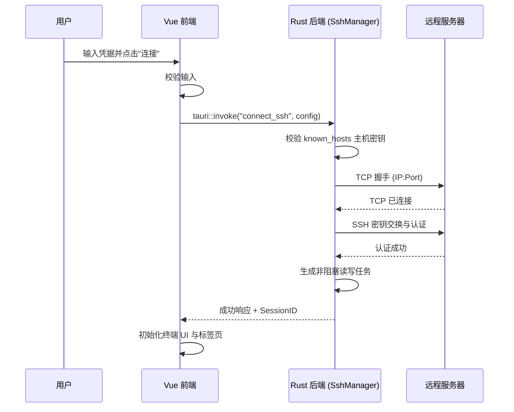
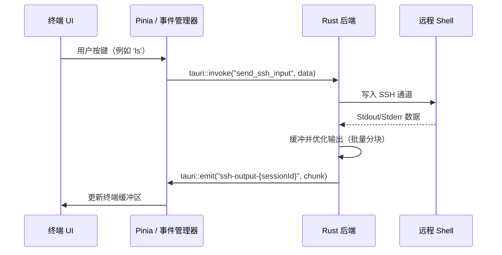

# NexaShell

[English](README.md) | **简体中文**

基于 **Rust** 与 **Vue 3** 构建的轻量级现代终端管理器与 SSH 客户端，以 Tauri 2 桌面应用形式打包分发。

[](https://github.com/chengvar-glitch/nexashell) [](LICENSE) [](.github/workflows/ci.yml)

> 版本号以 `src-tauri/Cargo.toml` 为唯一来源（`prebuild` 会自动同步到 `package.json`）。发布历史见 [CHANGELOG.md](./CHANGELOG.md)。

NexaShell 将 Rust 的安全性与高性能，与现代高生产力 Web 界面相结合，提供无缝的服务器管理体验。

---

## 🚀 核心特性

- **多会话管理**：基于强大的标签页界面，组织并快速切换多个 SSH 会话。
- **分屏面板**：任意终端标签页可水平/垂直拆分（⌘D / ⇧⌘D），支持拖拽调整大小、右键拆分，每个标签页最多 **3 个面板**。SSH 面板复用源会话的凭据，且不会暴露到响应式状态中。
- **会话持久化与分组**：安全存储服务器凭据，支持层级分组与自定义标签（AES-256-GCM 加密）。
- **硬件加速终端**：基于 `xterm.js` + WebGL 的低延迟渲染，内置终端内搜索（⌘F）。
- **终端主题系统**：One Dark / Modern / Solarized / GitHub 预设，默认跟随系统浅色/深色模式。
- **内置 SFTP 支持**：内置文件管理器，支持上传（拖拽、暂停/恢复/取消、块边界断点续传）、下载、新建目录、重命名与删除。
- **独立文件管理器窗口**：每个会话可打开独立的 SFTP 浏览窗口，从连接视图发起。
- **SSH 端口转发**：本地（`-L`）与动态 SOCKS5（`-D`）隧道，持久化规则在连接时自动启动。
- **命令片段库**：可复用的命令片段，配合快速启动命令面板（⌘⇧P）。
- **实时服务器仪表盘**：在连接视图中直接监控远程服务器状态（CPU、内存、磁盘、网络、Swap、负载、运行时长）。
- **本地终端**：基于原生 PTY 的本地 Shell 标签页。
- **安全加固**：基于 `known_hosts` 的主机密钥校验、操作系统钥匙串主密钥（含文件回退）、CSP、最小化 Tauri 能力权限。
- **会话导入/导出**：加密导出（随机盐 + PBKDF2），并兼容解密旧版格式。
- **可定制工作区**：深色/浅色模式、多种强调色、macOS 原生感应的悬浮标题栏。
- **跨平台**：macOS（Apple Silicon）为主要验证平台；Windows 构建在 CI 中持续编译（见 [平台状态](#平台状态)）。

---

## 🛠️ 快速开始

### 环境要求

- [Rust](https://www.rust-lang.org/tools/install)（最新稳定版）
- [Node.js](https://nodejs.org/)（>=18）— pnpm 与前端工具链的运行时
- [pnpm](https://pnpm.sh/)（>=9）— 包管理器

### 从源码构建

```bash
# 1. 克隆仓库
git clone git@github.com:chengvar-glitch/nexashell.git
cd nexashell

# 2. 安装依赖
pnpm install

# 3. 开发模式运行（打开 Tauri 窗口）
pnpm tauri dev

# 4. 生产构建
pnpm build && pnpm tauri build
```

---

## 🏗️ 架构设计

NexaShell 采用基于 [Tauri 2](https://tauri.app/) 的**多进程架构**，将 UI 关注点与底层系统操作分离。

### 高层概览

```mermaid
graph TD
    subgraph "前端层 (Vue 3)"
        UI[UI 组件]
        Store[Pinia 状态管理]
        EB[事件总线 / 快捷键]
    end

    subgraph "桥接层 (Tauri IPC)"
        Invoke[Tauri Invoke / Events]
    end

    subgraph "后端层 (Rust 核心)"
        SSH[SshManager — ssh.rs]
        TERM[TerminalManager — terminal.rs]
        TUN[TunnelManager — tunnel.rs]
        DB[数据库 — db/]
        SEC[加密模块]
    end

    UI <--> Invoke <--> SSH
    UI <--> Invoke <--> TERM
    UI <--> Invoke <--> TUN
    Store <--> Invoke <--> DB
    SSH <--> Remote[远程服务器 (SSH2)]
    TUN <--> Remote
```

### 后端模块（`src-tauri/src/`）

| 模块 | 职责 |
|---|---|
| `ssh.rs`（约 2,600 行） | SSH 连接生命周期、基于 `SO_KEEPALIVE` 的阻塞 I/O、批量输出事件、服务器状态监控、SFTP 上传/下载（支持按任务暂停/恢复/取消） |
| `ssh/hostkey.rs` | 基于用户 `known_hosts` 的主机密钥校验 |
| `db/mod.rs` | SQLite（会话、分组、标签、隧道规则、片段），支持 WAL、迁移、事务性更新 |
| `db/import_export.rs` | 加密会话导入/导出（PBKDF2 + AES-GCM），兼容旧版格式 |
| `encryption.rs` | AES-256-GCM + PBKDF2（390k 次迭代）、操作系统钥匙串主密钥（含 0600 权限文件回退）、敏感缓冲区 `zeroize` 清零 |
| `terminal.rs` | 基于 `portable-pty` 的本地 PTY、批量输入写入、尺寸变化监听 |
| `tunnel.rs` | 基于现有 SSH 会话的本地端口转发 + SOCKS5 动态转发 |
| `system.rs` | 平台检测、窗口控制、文件预览辅助 |

### 前端结构（`src/`）

- `components/` — UI 组件（连接、布局、文件管理器、设置、命令面板…）
- `features/` — 特性模块 + barrel 导出：`session`、`tabs`、`tunnel`、`snippet`、`settings`、`window`
- `composables/` — 可复用逻辑（`use-tab-management`、`use-sftp`、`use-transfer-queue`、`use-modal`、`use-remote-path`）
- `core/` — 配置、常量、i18n、类型、工具（日志、主题管理、快捷键管理、事件总线）
- 两个 HTML 入口：`index.html`（主窗口）与 `filemanager.html`（独立 SFTP 窗口）

---

## 🔗 核心工作流

### SSH 连接时序



### 终端 I/O 数据流



---

## ⚙️ 开发命令

| 命令 | 用途 |
|---|---|
| `pnpm dev` | Vite 开发服务器（仅 Web，端口 1420） |
| `pnpm tauri dev` | 完整原生应用开发模式 |
| `pnpm build` | `vue-tsc --noEmit && vite build` |
| `pnpm lint` | ESLint（自动修复） |
| `pnpm lint:check` | ESLint（不自动修复，适合 CI） |
| `pnpm type-check` | `vue-tsc --noEmit` |
| `pnpm test` | 前端单元测试（Vitest、happy-dom） |
| `pnpm test:coverage` | 前端测试 + 覆盖率报告 |
| `cargo test` | Rust 单元测试（在 `src-tauri/` 下运行） |
| `cargo clippy` | Rust 代码检查（CI 中使用 `-D warnings`） |
| `pnpm tauri build` | 生产桌面打包（macOS 出 DMG，Windows 出 NSIS） |

---

## 🔌 Tauri IPC 接口

后端命令注册于 `src-tauri/src/lib.rs`（约 70 个 invoke 处理器）。分组概览：

- **系统与窗口**：`get_platform`、`get_arch`、`is_macos`/`is_windows`/`is_linux`、`quit_app`、`toggle_maximize`、`minimize_window`、`close_window`
- **SSH 连接**：`connect_ssh`、`disconnect_ssh`、`send_ssh_input`、`get_buffered_ssh_output`、`set_ssh_status_refresh_rate`、`probe_remote_path`、`forget_host_key`
- **SFTP**：`upload_file_sftp`、`pause_upload`、`resume_upload`、`cancel_upload`、`sftp_list_dir`、`sftp_download_file`、`cancel_download`、`sftp_remove`、`sftp_mkdir`、`sftp_rename`
- **本地终端**：`connect_local`、`disconnect_local`
- **会话**：`save_session`、`save_session_with_credentials`、`update_session_timestamp`、`list_sessions`、`get_session_credentials`、`get_sessions`、`get_sessions_with_relations`、`edit_session`、`delete_session`、`toggle_favorite`
- **分组 / 标签**：`add_group` / `add_tag`、`list_groups` / `list_tags`、`edit_group` / `edit_tag`、`delete_group` / `delete_tag`、`link_session_group` / `link_session_tag`、`unlink_session_group` / `unlink_session_tag`、`list_groups_for_session` / `list_tags_for_session`
- **导入/导出**：`export_sessions`、`import_sessions`
- **隧道**：`start_session_tunnels`、`start_tunnel_rule`、`stop_session_tunnels`、`stop_tunnel_rule`、`list_tunnel_status`，以及 `add_tunnel_rule`、`list_tunnel_rules`、`update_tunnel_rule`、`delete_tunnel_rule`、`delete_tunnel_rules_for_session`
- **片段**：`add_snippet`、`list_snippets`、`update_snippet`、`delete_snippet`

**流式事件**（Tauri `emit`，按会话命名空间）：

- `ssh-output-{sessionId}` — 终端输出分块（批量）
- `ssh-status-{sessionId}` — 服务器仪表盘指标（CPU/内存/磁盘/…）
- `ssh-upload-progress-{sessionId}` / `ssh-download-progress-{sessionId}` — SFTP 传输进度
- `ssh-disconnected-{sessionId}` — 会话结束（服务器关闭 / 出错）
- `ssh-input-{sessionId}` / `ssh-resize-{sessionId}` — 前端 → 后端（按键 / PTY 尺寸）

---

## 🛡️ 安全

- **凭据安全**：密码与私钥在存储前使用 AES-256-GCM 加密；主密钥存放于操作系统钥匙串（macOS Keychain / Windows 凭据管理器 / Linux Secret Service），并带有 0600 权限文件回退。损坏的钥匙串条目会被**拒绝**而非静默重建，确保已有凭据永不丢失。
- **主机密钥校验**：SSH 连接基于 `known_hosts` 校验远程主机密钥（TOFU，类似 `StrictHostKeyChecking`），防止中间人攻击。
- **内存卫生**：敏感明文不进入前端响应式状态（非响应式凭据缓存），并在 Rust 侧销毁时清零。
- **沙箱化 WebView**：严格 CSP（`default-src 'self'`）、最小化 Tauri 能力权限、`object-src 'none'`。
- **Rust 内存安全**：所有核心 SSH/终端逻辑均以内存安全的 Rust 实现。

---

## 🖥️ 平台状态

| 平台 | 状态 |
|---|---|
| macOS（Apple Silicon） | ✅ 支持 — 完整测试，DMG 发布构建已验证 |
| macOS（Intel） | ❌ 不支持（发布构建仅面向 `aarch64`） |
| Windows | 🟡 仅 CI 编译（ubuntu 上 `cargo check`/`test`/`clippy`；MSVC/NSIS 路径未实际演练） |
| Linux | 🟡 已安装 webkit2gtk 依赖的 CI 编译；无运行时验证 |

> 持续集成（`.github/workflows/ci.yml`）：每次 push/PR 执行 lint + 类型检查 + 前端测试（pnpm）以及 `cargo check` + `test` + `clippy -D warnings`。

---

**NexaShell** 采用 [MIT 许可证](LICENSE) 授权。
